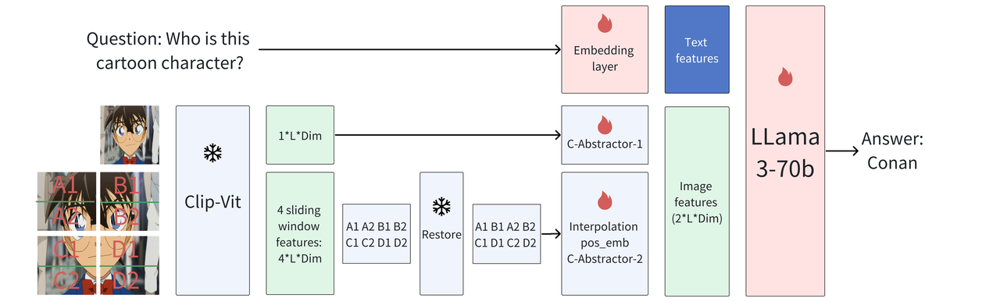

# 360VL

<p align="center">
  
</p>

**360VL** is developed based on the LLama3 language model and is also the industry's first open source large multi-modal model based on **LLama3-70B**[[🤗Meta-Llama-3-70B-Instruct](https://huggingface.co/meta-llama/Meta-Llama-3-70B-Instruct)]. In addition to applying the Llama3 language model, the 360VL model also designs a globally aware multi-branch projector architecture, which enables the model to have more sufficient image understanding capabilities.


## Contents
- [Install](#install)
- [Model Zoo](#llava-weights)
- [Demo](#Demo)
- [Evaluation](#evaluation)

## Install

1. Clone this repository and navigate to 360VL folder
```bash
git clone https://github.com/360CVGroup/360VL.git
cd 360VL
```

2. Install Package
```Shell
conda create -n qh360_vl python=3.10 -y
conda activate qh360_vl
bash deploy.sh
```

## Model Zoo
| Model               | Checkpoints   | MMB<sub>T  | MMB<sub>D|MMB-CN<sub>T  | MMB-CN<sub>D|MMMU<sub>V|MMMU<sub>T| MME |
|:--------------------|:------------:|:----:|:------:|:------:|:-------:|:-------:|:-------:|:-------:|
| QWen-VL-Chat |  [🤗LINK](https://huggingface.co/Qwen/Qwen-VL-Chat) | 61.8 | 60.6 |  56.3  |  56.7  |37| 32.9  | 1860 |
| mPLUG-Owl2 |  [🤖LINK](https://www.modelscope.cn/models/iic/mPLUG-Owl2/summary) | 66.0 | 66.5 |  60.3  |  59.5  |34.7| 32.1  | 1786.4 |
| CogVLM |  [🤗LINK](https://huggingface.co/THUDM/cogvlm-grounding-generalist-hf) | 65.8| 63.7 | 55.9  | 53.8    |37.3| 30.1 | 1736.6|
| Monkey-Chat |  [🤗LINK](https://huggingface.co/echo840/Monkey-Chat) | 72.4| 71 | 67.5  | 65.8    |40.7| - | 1887.4|
| MM1-7B-Chat |  [LINK](https://ar5iv.labs.arxiv.org/html/2403.09611) | -| 72.3 | -  | -    |37.0| 35.6 |  1858.2|
| IDEFICS2-8B |  [🤗LINK](https://huggingface.co/HuggingFaceM4/idefics2-8b) | 75.7 | 75.3 | 68.6  | 67.3    |43.0| 37.7 |1847.6| 
| Honeybee |  [LINK](https://github.com/kakaobrain/honeybee) | 74.3 | 74.3 | -  | -    |36.2|  -|1950| 
| SVIT-v1.5-13B|  [🤗LINK](https://huggingface.co/Isaachhe/svit-v1.5-13b-full) | 69.1 | - | 63.1  |  -  | 38.0| 33.3|1889| 
| LLaVA-v1.5-13B |  [🤗LINK](https://huggingface.co/liuhaotian/llava-v1.5-13b) | 69.2 | 69.2 | 65  | 63.6    |36.4| 33.6 | 1826.7| 
| LLaVA-v1.6-13B |  [🤗LINK](https://huggingface.co/liuhaotian/llava-v1.6-vicuna-13b) | 70 | 70.7 | 68.5  | 64.3    |36.2| - |1901|
| YI-VL-34B |  [🤗LINK](https://huggingface.co/01-ai/Yi-VL-34B) | 72.4 | 71.1 |  70.7 |   71.4  |45.1| 41.6 |2050.2|
| **360VL-8B** |  [🤗LINK](https://huggingface.co/qihoo360/360VL-8B) | 75.3 | 73.7 | 71.1   | 68.6    |39.7| 37.1 |  1899.1|
| **360VL-70B** |  [🤗LINK](https://huggingface.co/qihoo360/360VL-70B) | 78.1 | 80.4 | 76.9   | 77.7    |50.8| 44.3 |  1983.2|


## Quick Start 🤗

```Shell
from transformers import AutoModelForCausalLM, AutoTokenizer
import torch
from PIL import Image

checkpoint = "qihoo360/360VL-70B"

model = AutoModelForCausalLM.from_pretrained(checkpoint, torch_dtype=torch.float16, device_map='auto', trust_remote_code=True).eval()
tokenizer = AutoTokenizer.from_pretrained(checkpoint, trust_remote_code=True)
vision_tower = model.get_vision_tower()
vision_tower.load_model()
vision_tower.to(device="cuda", dtype=torch.float16)
image_processor = vision_tower.image_processor
tokenizer.pad_token = tokenizer.eos_token


image = Image.open("docs/008.jpg").convert('RGB')
query = "Who is this cartoon character?"
terminators = [
    tokenizer.convert_tokens_to_ids("<|eot_id|>",)
]

inputs = model.build_conversation_input_ids(tokenizer, query=query, image=image, image_processor=image_processor)

input_ids = inputs["input_ids"].to(device='cuda', non_blocking=True)
images = inputs["image"].to(dtype=torch.float16, device='cuda', non_blocking=True)

output_ids = model.generate(
    input_ids,
    images=images,
    do_sample=False,
    eos_token_id=terminators,
    num_beams=1,
    max_new_tokens=512,
    use_cache=True)

input_token_len = input_ids.shape[1]
outputs = tokenizer.batch_decode(output_ids[:, input_token_len:], skip_special_tokens=True)[0]
outputs = outputs.strip()
print(outputs)
```

## Demo

To run our demo, you need to download the weights of 360VL[🤗LINK](https://huggingface.co/qihoo360/360VL-70B) and the weights of CLIP-ViT-336[🤗LINK](https://huggingface.co/openai/clip-vit-large-patch14-336)

### Gradio Web UI

To launch a Gradio demo locally, please run the following commands one by one. If you plan to launch multiple model workers to compare between different checkpoints, you only need to launch the controller and the web server *ONCE*.

#### Launch a controller
```Shell
python -m qh360_vl.serve.controller --host 0.0.0.0 --port 10000
```

#### Launch a gradio web server.
```Shell
python -m qh360_vl.serve.gradio_web_server --controller http://localhost:10000 --model-list-mode reload
```
You just launched the Gradio web interface. Now, you can open the web interface with the URL printed on the screen. You may notice that there is no model in the model list. Do not worry, as we have not launched any model worker yet. It will be automatically updated when you launch a model worker.

#### Launch a model worker

This is the actual *worker* that performs the inference on the GPU.  Each worker is responsible for a single model specified in `--model-path`.

Note that the 8B model supports single-card inference, but the 70B model requires 8-card inference.

```Shell
CUDA_VISIBLE_DEVICES=0 python -m qh360_vl.serve.model_worker --host 0.0.0.0 --controller http://localhost:10000 --port 40000 --worker http://localhost:40000 --model-path qihoo360/360VL-8B
```

```Shell
CUDA_VISIBLE_DEVICES=0,1,2,3,4,5,6,7 python -m qh360_vl.serve.model_worker --host 0.0.0.0 --controller http://localhost:10000 --port 40000 --worker http://localhost:40000 --model-path qihoo360/360VL-70B
```

### CLI Inference

Chat about images using 360VL without the need of Gradio interface. 

```Shell
INIT_MODEL_PATH="/hbox2dir"
name="360VL-8B"
python -m qh360_vl.eval.infer \
    --model-path $INIT_MODEL_PATH/$name \
```


### Download Llama3 checkpoints (Non-essential)

360VL is developed based on Llama 3. If you have needs, please download the weights yourself.

[[🤗Meta-Llama-3-8B-Instruct](https://huggingface.co/meta-llama/Meta-Llama-3-8B-Instruct)]
[[🤗Meta-Llama-3-70B-Instruct](https://huggingface.co/meta-llama/Meta-Llama-3-70B-Instruct)]

## Evaluation
We refer to the evaluation data organization method of LLava-1.5, which can be found in the following documents.  [Evaluation.md](docs/Evaluation.md)

```Shell
bash scripts/eval/mme.sh
bash scripts/eval/mmb_cn.sh
bash scripts/eval/mmb_en.sh
bash scripts/eval/refcoco.sh
CUDA_VISIBLE_DEVICES=0,1,2,3,4,5,6,7 bash ./scripts/eval/gqa.sh
CUDA_VISIBLE_DEVICES=0,1,2,3,4,5,6,7 bash ./scripts/eval/vqav2.sh
bash scripts/eval/llavabench.sh
bash scripts/eval/mmmu.sh
bash scripts/eval/pope.sh
bash scripts/eval/textvqa.sh
```

<!-- ## Acknowledgement -->

## License

This project utilizes certain datasets and checkpoints that are subject to their respective original licenses. Users must comply with all terms and conditions of these original licenses.
The content of this project itself is licensed under the [Apache license 2.0](./LICENSE).

## Related Projects
This work wouldn't be possible without the incredible open-source code of these projects. Huge thanks!
- [Meta Llama 3](https://github.com/meta-llama/llama3)
- [LLaVA: Large Language and Vision Assistant](https://github.com/haotian-liu/LLaVA)
- [Honeybee: Locality-enhanced Projector for Multimodal LLM](https://github.com/kakaobrain/honeybee)


